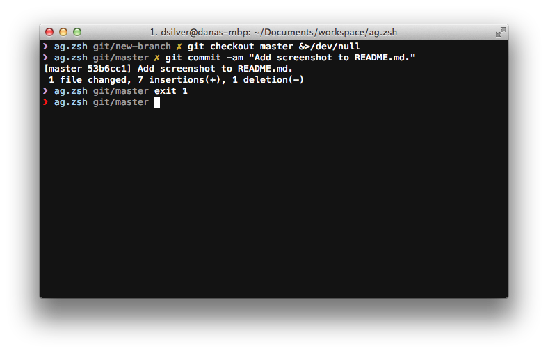

### My zsh prompt

A clean, minimal prompt with return status, current directory, git branch and
git dirty/clean indicator.



### Install

```sh
$ git clone https://github.com/danasilver/ag.zsh.git

$ cp ag.zsh/ag.zsh-theme ~/.oh-my-zsh/themes
```

Then set `ZSH_THEME` in your `.zshrc` to `"AG"`.

### License

The MIT License